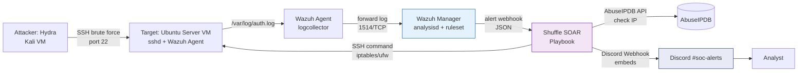
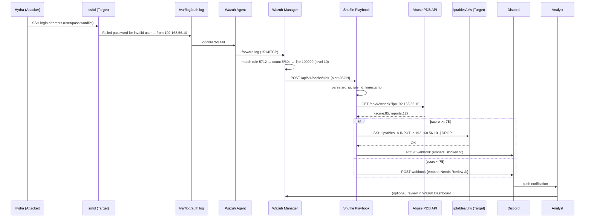

# Architecture — SSH Brute Force Automated Response (Wazuh + Shuffle)

> **Scope:** Automated detection and response for SSH brute force attacks in an isolated lab environment using Wazuh (SIEM) and Shuffle (SOAR). This document is the *single source of truth* for architecture; a summary is available in [`README.md`](../README.md).

---

## 1. Overview & Goals

### 1.1 Background
SSH is one of the most commonly brute-forced services on internet-facing servers. This project builds a fully automated *detect-to-response* pipeline without manual analyst intervention: Hydra attacks an Ubuntu Server VM, Wazuh detects the activity, and Shuffle automatically blocks the attacker IP and notifies analysts via Discord.

### 1.2 Goals
- Detect repeated SSH `Failed password` events on an Ubuntu Server VM in real time via Wazuh.
- Automatically block the attacker IP via a Shuffle playbook once a threshold is crossed (e.g., 5 attempts / 60 seconds).
- Enrich the attacker IP with AbuseIPDB reputation before blocking.
- Send real-time notifications to analysts via **Discord Webhook**.
- Measure **MTTD** (Mean Time to Detect) and **MTTR** (Mean Time to Respond) for automated vs. manual response.

### 1.3 Non-Goals
- Global SSH hardening (key-only auth, permanent fail2ban) — out of scope for the SOAR pipeline.
- Non-SSH attack detection (SQLi, webshell) — planned as a separate integration.
- Production internet-facing deployment — isolated lab (NAT/Host-Only) only (see §8).

---

## 2. High-Level Architecture

### 2.1 Logical Diagram



> Fallback ASCII (for viewers without Mermaid support):
```
[Attacker: Hydra] --(SSH brute force)--> [Target: Ubuntu Server VM]
                                                    |
                                          (/var/log/auth.log)
                                                    v
                                          [Wazuh Agent]  --(installed on Ubuntu VM)
                                                    |
                                          (forward log to)
                                                    v
                                          [Wazuh Manager]
                                          (rule 5710/5712 + custom threshold rule)
                                                    |
                                          (alert via webhook/integration)
                                                    v
                                          [Shuffle Playbook]
                                          1. Check IP reputation via AbuseIPDB
                                          2. Block IP (iptables / ufw / firewall)
                                          3. Send notification (Discord Webhook)
                                                    v
                                          [Discord #soc-alerts]
```

### 2.2 Topology Mapping

| Node | Role | Network | Access |
|---|---|---|---|
| Attacker VM | Host + Ncrack | `192.168.1.12/24` (Host-Only / NAT lab) | Only to Target:22 |
| Target VM | Ubuntu Server + sshd + Wazuh Agent | `192.168.1.10/24` | 22 (SSH), 1514 (to Manager) |
| Wazuh Manager | SIEM | `192.168.1.11` or cloud | 1514, 55000 (API), 443 (Dashboard) |
| Shuffle | SOAR (cloud SaaS / self-hosted) | Internet / lab | Webhook inbound, egress to Target:22 & Discord |
| Discord | Notification | Internet | Webhook URL |

All lab nodes are isolated on a Host-Only / Internal NAT VirtualBox network. No exposure to the public internet.

---

## 3. Components

### 3.1 Target — Ubuntu Server VM

- **OS:** Ubuntu Server 22.04 LTS (SSH enabled, `PasswordAuthentication yes` for simulation).
- **Service:** `sshd` logs to `/var/log/auth.log` with format `Failed password for <user> from <ip> port <port> ssh2`.
- **Wazuh Agent:** `wazuh-agent` 4.x, connected to the Manager via `1514/TCP`. Log configuration in `wazuh/ossec-agent-conf/ossec.conf`:
  ```xml
  <localfile>
    <log_format>syslog</log_format>
    <location>/var/log/auth.log</location>
  </localfile>
  ```
- **Blocking capability:** `iptables` / `ufw` installed; the Shuffle SSH user has a restricted key with `sudo` access for `iptables -A INPUT -s <ip> -j DROP`.

### 3.2 SIEM — Wazuh Manager

- **Components:** `wazuh-manager` (analysisd, remoted), `wazuh-indexer`, `wazuh-dashboard`.
- **Built-in rules:** `5710` (Attempt to login using a non-existent user), `5712` (Failed password), `5716` (Multiple authentication failures).
- **Custom threshold rule** (`wazuh/custom-rules/local_rules.xml`):
  ```xml
  <group name="ssh_brute_force,">
    <rule id="100200" level="10" frequency="5" timeframe="60">
      <if_matched_sid>5712</if_matched_sid>
      <same_source_ip />
      <description>SSH brute force: 5 failed passwords from same IP in 60s</description>
      <group>authentication_failures,attack,</group>
      <mitre><id>T1110.001</id></mitre>
    </rule>
    <!-- Optional escalation: 10 fails / 120s → level 12 -->
    <rule id="100201" level="12" frequency="10" timeframe="120">
      <if_matched_sid>5712</if_matched_sid>
      <same_source_ip />
      <description>SSH brute force escalated: 10 fails in 120s</description>
    </rule>
  </group>
  ```
- **Shuffle integration:** `ossec.conf` on the Manager:
  ```xml
  <integration>
    <name>shuffle</name>
    <hook_url>https://shuffler.io/api/v1/hooks/<webhook_id></hook_url>
    <level>3</level>
    <group>ssh_brute_force</group>
    <alert_format>json</alert_format>
  </integration>
  ```
  Alternative: `Wazuh → TheHive → Shuffle` or `Wazuh webhook → Shuffle trigger`.

### 3.3 SOAR — Shuffle Playbook

**Trigger:** `Webhook` — receives the Wazuh alert JSON.

**Workflow (6 steps):**

| # | Step | App | Input | Output |
|---|---|---|---|---|
| 1 | Parse Alert | Shuffle Tools | `{{$trigger.body}}` | `src_ip`, `attempts`, `rule_id`, `timestamp` |
| 2 | Enrich — AbuseIPDB | HTTP / AbuseIPDB | `src_ip` | `abuseConfidenceScore`, `totalReports`, `isWhitelisted` |
| 3 | Decision | Shuffle Condition | `score >= 75?` | branch: `auto_block` vs `escalate` |
| 4a | Block IP (auto) | SSH Command | `iptables -A INPUT -s {{src_ip}} -j DROP && ufw deny from {{src_ip}}` | `block_status` |
| 4b | Escalate (low score) | Discord (different embed) | — | `NEEDS REVIEW` notification without block |
| 5 | Notify | Discord Webhook | embed JSON | message_id |
| 6 | Log | Shuffle Datastore | — | stored for MTTR measurement |

**Idempotency:** Before blocking, check `iptables -C INPUT -s <ip> -j DROP` to avoid duplicates.

**Failure handling:** 3 retries for SSH, 10s timeout for AbuseIPDB. If Discord fails, the Shuffle execution is still marked successful and logged.

Playbook export: `shuffle/playbook-export.json`.

### 3.4 Threat Intelligence — AbuseIPDB API

- **Endpoint:** `GET https://api.abuseipdb.com/api/v2/check?ipAddress={{src_ip}}&maxAgeInDays=90`
- **Header:** `Key: $ABUSEIPDB_API_KEY`, `Accept: application/json`
- **Key fields:** `abuseConfidenceScore` (0–100), `totalReports`, `isWhitelisted`.
- **Threshold:** `>= 75` → auto-block, `25–74` → escalate with context, `<25` + `level 12` still blocks (local brute-force confidence overrides).
- **Rate limit:** 1000 req/day (free tier) — sufficient for lab use.
- **Secret:** `ABUSEIPDB_API_KEY` stored as a Shuffle Environment variable, never in the JSON export.

### 3.5 Response — iptables / ufw

Two execution options; **SSH command via Shuffle** is the primary:

| Option | Method | Pros | Cons |
|---|---|---|---|
| **A — Shuffle SSH (chosen)** | Shuffle app `SSH` → `sudo iptables -A INPUT -s <ip> -j DROP` | Centralized in playbook, auditable, no Active Response needed on Manager | Requires Shuffle → Target SSH credentials |
| B — Wazuh Active Response | `active-response` on Manager triggers `firewall-drop` script on Agent | No Shuffle needed for blocking, slightly faster | Less flexible for enrichment-based branching |

Verification commands:
```bash
sudo iptables -L -n --line-numbers | grep <attacker-ip>
sudo ufw status numbered | grep <attacker-ip>
# Unblock (rollback):
sudo iptables -D INPUT -s <attacker-ip> -j DROP
sudo ufw delete deny from <attacker-ip>
```

### 3.6 Notification — Discord (Webhook)

> **Replaces Telegram Bot API** — Discord was chosen for richer embeds, simpler webhook setup, and native Shuffle integration.

**Why Discord (not Telegram Bot):**
- No `BotFather` / `chat_id` needed — a single Webhook URL per channel is enough.
- Rich `embeds` support (color, fields, footer, timestamp) — incidents are easier for analysts to read.
- Webhook rate limit `30 req/min` is sufficient for brute-force bursts.
- Shuffle has native `Discord` and generic `Webhook` apps — no custom code required.

**One-time setup:**
1. Discord Server → `Server Settings → Integrations → Webhooks → New Webhook` → select channel `#soc-alerts` → `Copy Webhook URL` → format `https://discord.com/api/webhooks/{id}/{token}`.
2. Shuffle → `Environments` → add secret `DISCORD_WEBHOOK_URL`.
3. Playbook step `Discord` → `Webhook POST` to that URL.

**Embed payload (auto-block path):**
```json
{
  "username": "Wazuh-Shuffle SOAR",
  "avatar_url": "https://wazuh.com/uploads/2022/05/wazuh-logo.png",
  "embeds": [{
    "title": "🚨 SSH Brute Force Blocked",
    "color": 15548997,
    "fields": [
      {"name": "Attacker IP", "value": "`192.168.56.10`", "inline": true},
      {"name": "Attempts", "value": "12 in 60s", "inline": true},
      {"name": "Rule", "value": "100200 (level 10)", "inline": true},
      {"name": "Action", "value": "✅ `iptables DROP`", "inline": true},
      {"name": "AbuseIPDB", "value": "Score 85% (12 reports)", "inline": true},
      {"name": "Target", "value": "192.168.56.20:22", "inline": true}
    ],
    "footer": {"text": "Wazuh Manager → Shuffle • T1110.001"},
    "timestamp": "2026-09-01T10:10:00.000Z"
  }]
}
```

**Escalation payload (low confidence, no auto-block):**
```json
{
  "embeds": [{
    "title": "⚠️ SSH Brute Force — Needs Review",
    "color": 16776960,
    "fields": [
      {"name": "Attacker IP", "value": "`203.0.113.45`", "inline": true},
      {"name": "AbuseIPDB", "value": "Score 22% — low confidence", "inline": true},
      {"name": "Recommendation", "value": "Manual review in Wazuh Dashboard"}
    ]
  }]
}
```

**Alternatives considered:**
- Discord Bot API (`bot token` + Gateway) — rejected, overkill for one-way notifications.
- Telegram — rejected per current project requirements (can be re-added later as a multi-channel fallback).

**Security:**
- The Webhook URL is a secret equivalent to a password — never commit it, never log the full URL.
- Rotation: `Integrations → Webhook → Regenerate` if leaked.
- Validation: Shuffle does not expose the URL in `playbook-export.json` (use `$env.DISCORD_WEBHOOK_URL`).

**Manual verification:**
```bash
curl -H "Content-Type: application/json" \
  -d '{"embeds":[{"title":"Test Wazuh-Shuffle","description":"IP 1.2.3.4 blocked — test embed"}]}' \
  "$DISCORD_WEBHOOK_URL"
```

---

## 4. Data Flow & Sequence

### 4.1 Sequence Diagram



### 4.2 Example Alert JSON (Wazuh → Shuffle)

```json
{
  "timestamp": "2026-09-01T10:10:00.000Z",
  "rule": {"id": "100200", "level": 10, "description": "SSH brute force: 5 failed passwords from same IP in 60s", "groups": ["authentication_failures"]},
  "agent": {"id": "001", "name": "ubuntu-target", "ip": "192.168.56.20"},
  "data": {"srcip": "192.168.56.10", "dstuser": "root", "auth_method": "password"},
  "full_log": "Sep  1 10:09:55 ubuntu-target sshd[1234]: Failed password for root from 192.168.56.10 port 54321 ssh2",
  "location": "/var/log/auth.log"
}
```

---

## 5. Detection Logic

### 5.1 Rule Tuning

- `frequency` and `timeframe` are set to `5/60` to be sensitive for lab Hydra (default Hydra 16 threads → 5 failures in <5 seconds). For production, consider `10/120` to reduce false positives from user typos.
- `same_source_ip` ensures the threshold is per-IP, not global.
- Level `10` triggers the Shuffle integration (filter `level >=10`).

### 5.2 False Positive Mitigation

- Whitelist analyst / CI IPs: `<ignore><src_ip>192.168.56.1</src_ip></ignore>` in the rule.
- Correlate with AbuseIPDB `isWhitelisted`.
- Future: adaptive threshold based on normal login baseline.

### 5.3 Testing

```bash
# Simulate logs without Hydra (for rule testing)
logger -t sshd "Failed password for root from 192.168.56.10 port 12345 ssh2"
# Repeat 5x within 60s, then check:
tail -f /var/ossec/logs/alerts/alerts.json | jq 'select(.rule.id=="100200")'
```

---

## 6. Response Logic (Playbook Detail)

See §3.3 for the step table. Decision tree:

```
alert(100200) → AbuseIPDB score?
  ├─ >=75 → block + notify (red embed)
  ├─ 25–74 + level 12 → block (local confidence override) + notify
  └─ <25 → notify only (yellow embed) + manual review
```

**Rollback:** Analysts can unblock via a Discord command (future) or manual SSH:
```bash
sudo iptables -D INPUT -s <ip> -j DROP
```

---

## 7. Network Topology (Lab)

```
                    [Host-Only / NAT Network: 192.168.56.0/24]
  ┌─────────────┐         ┌──────────────────┐         ┌─────────────────┐
  │ Kali Attacker│:22────▶│ Ubuntu Target    │:1514──▶│ Wazuh Manager   │
  │ 192.168.56.10│         │ 192.168.56.20    │         │ 192.168.56.30   │
  └─────────────┘         │ + Wazuh Agent    │         │ + Dashboard :443│
                          └────────┬─────────┘         └────────┬────────┘
                                   │:22 (Shuffle SSH)           │ webhook
                          ┌────────▼─────────┐                  ▼
                          │ Shuffle Cloud    │◀─────────────────┘
                          │ playbook         │──Discord webhook──▶ #soc-alerts
                          └──────────────────┘
```

**Firewall requirements:**
- Target → Manager: `1514/TCP` outbound.
- Shuffle → Target: `22/TCP` inbound (restricted to Shuffle IPs / VPN).
- Target/Manager → Internet: `443/TCP` for AbuseIPDB & Discord.

---

## 8. Security & Safety

- **Ethics:** Simulations are performed only against self-owned VMs on an isolated network (Host-Only). Do not use wordlists against public hosts — see `README.md#Ethics`.
- **Secrets:** `ABUSEIPDB_API_KEY` and `DISCORD_WEBHOOK_URL` are never committed. Use Shuffle Secrets / env vars. Example `.env.example`:
  ```
  ABUSEIPDB_API_KEY=your_key_here
  DISCORD_WEBHOOK_URL=https://discord.com/api/webhooks/xxx/yyy
  ```
- **Least privilege:** The Shuffle SSH user is only allowed `sudo iptables` / `sudo ufw`, not full root (via `/etc/sudoers.d/shuffle`).
- **Log retention:** `auth.log` and `alerts.json` are rotated daily.

---

## 9. Observability & Metrics

| Metric | Definition | How to measure |
|---|---|---|
| MTTD | `alert_timestamp - first_failed_login` | Compare `auth.log` vs `alerts.json` |
| MTTR | `block_timestamp - alert_timestamp` | `iptables` log / Shuffle execution log vs alert |
| Manual baseline | Time for analyst to see Dashboard → SSH `iptables` manually | Lab stopwatch |

Results will be filled in `README.md#Results` after testing. Future: Grafana dashboard from the Wazuh Indexer.

---

## 10. Trade-offs & Future Work

| Decision | Trade-off |
|---|---|
| Shuffle SSH vs Wazuh Active Response | SSH is more auditable & branchable, but requires extra credentials |
| Discord Webhook vs Bot | Webhook is simple, but not interactive (no unblock button) — Bot for phase 2 |
| Threshold 5/60 | Sensitive for demos, but noisy in production — needs tuning |

**Roadmap:**
- Integration with SQLi & Web Shell detection (PHP-MySQL app) as a unified Automated IR system.
- Adaptive branching: ML-based confidence instead of static 75.
- MTTD/MTTR dashboard + Discord thread per incident.
- Multi-channel fallback: Discord primary, Telegram optional.

---

## 11. References & Repo Map

```
.
├── docs/
│   ├── architecture.md       # ← this file
│   └── screenshots/          # Wazuh alert, Shuffle workflow, Discord embed, iptables
├── wazuh/
│   ├── custom-rules/         # local_rules.xml (rule 100200/100201)
│   └── ossec-agent-conf/     # ossec.conf ( /var/log/auth.log )
├── shuffle/
│   └── playbook-export.json  # exported workflow (without secrets)
├── attack-simulation/
│   └── wordlist.txt
└── README.md                 # summary + link to this document
```

- Wazuh docs: https://documentation.wazuh.com/
- Shuffle docs: https://shuffler.io/docs
- AbuseIPDB API: https://docs.abuseipdb.com/
- Discord Webhooks: https://discord.com/developers/docs/resources/webhook
- MITRE ATT&CK T1110.001 — Brute Force: Password Guessing

---

*Author: Fransiskus Sutanto — Informatics Engineering, Universitas Bunda Mulia*
*Last updated: 2026-09-02*
