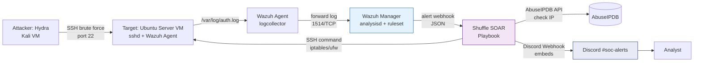
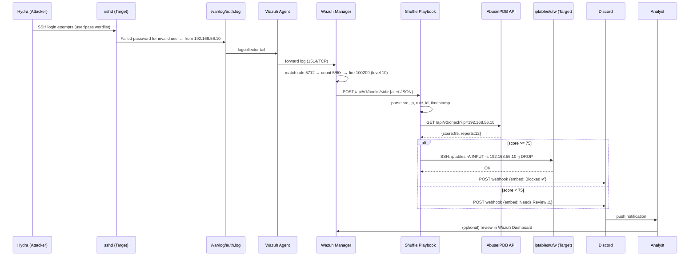

# Architecture — SSH Brute Force Automated Response (Wazuh + Shuffle)

> **Scope:** Deteksi dan respons otomatis SSH brute force di lab terisolasi menggunakan Wazuh (SIEM) dan Shuffle (SOAR). Dokumen ini adalah *single source of truth* arsitektur; ringkasan ada di [`README.md`](../README.md).

---

## 1. Overview & Goals

### 1.1 Background
SSH adalah layanan yang paling sering menjadi target brute force pada server yang terekspos. Proyek ini membangun pipeline *detect-to-response* tanpa intervensi analis manual: Hydra menyerang Ubuntu Server VM, Wazuh mendeteksi, Shuffle memblokir IP dan memberi notifikasi ke Discord.

### 1.2 Goals
- Deteksi *repeated failed password* SSH pada Ubuntu Server VM secara real-time via Wazuh.
- Blokir otomatis IP penyerang via playbook Shuffle setelah melewati threshold (mis. 5 percobaan / 60 detik).
- Enrichment reputasi IP via AbuseIPDB sebelum aksi blokir.
- Notifikasi real-time ke analis via **Discord Webhook**.
- Ukur **MTTD** (Mean Time to Detect) dan **MTTR** (Mean Time to Respond) otomatis vs manual.

### 1.3 Non-Goals
- Hardening SSH global (key-only auth, fail2ban permanen) — di luar pipeline SOAR.
- Deteksi serangan non-SSH (SQLi, webshell) — direncanakan sebagai integrasi terpisah.
- Deployment production internet-facing — lab NAT terisolasi saja (lihat §8).

---

## 2. High-Level Architecture

### 2.1 Logical Diagram



> Fallback ASCII (untuk viewer tanpa Mermaid):
```
[Attacker: Hydra] --(SSH brute force)--> [Target: Ubuntu Server VM]
                                                    |
                                          (/var/log/auth.log)
                                                    v
                                          [Wazuh Agent]  --(installed on Ubuntu VM)
                                                    |
                                          (forward log to)
                                                    v
                                          [Wazuh Manager]
                                          (rule 5710/5712 + custom threshold rule)
                                                    |
                                          (alert via webhook/integration)
                                                    v
                                          [Shuffle Playbook]
                                          1. Check IP reputation via AbuseIPDB
                                          2. Block IP (iptables / ufw / firewall)
                                          3. Send notification (Discord Webhook)
                                                    v
                                          [Discord #soc-alerts]
```

### 2.2 Topology Mapping

| Node | Role | Network | Akses |
|---|---|---|---|
| Attacker VM | Kali + Hydra | `192.168.56.10/24` (Host-Only / NAT lab) | Hanya ke Target:22 |
| Target VM | Ubuntu Server + sshd + Wazuh Agent | `192.168.56.20/24` | 22 (SSH), 1514 (ke Manager) |
| Wazuh Manager | SIEM | `192.168.56.30` atau cloud | 1514, 55000 (API), 443 (Dashboard) |
| Shuffle | SOAR (cloud SaaS / self-host) | Internet / lab | Webhook inbound, egress ke Target:22 & Discord |
| Discord | Notifikasi | Internet | Webhook URL |

Semua node lab berada di jaringan terisolasi (Host-Only / Internal NAT VirtualBox). Tidak ada eksposur ke internet publik.

---

## 3. Components

### 3.1 Target — Ubuntu Server VM

- **OS:** Ubuntu Server 22.04 LTS (SSH enabled, `PasswordAuthentication yes` untuk simulasi).
- **Service:** `sshd` log ke `/var/log/auth.log` dengan format `Failed password for <user> from <ip> port <port> ssh2`.
- **Wazuh Agent:** `wazuh-agent` 4.x, terhubung ke Manager via `1514/TCP`. Konfigurasi log di `wazuh/ossec-agent-conf/ossec.conf`:
  ```xml
  <localfile>
    <log_format>syslog</log_format>
    <location>/var/log/auth.log</location>
  </localfile>
  ```
- **Blocking capability:** `iptables` / `ufw` terinstal, user Shuffle memiliki akses SSH key terbatas untuk eksekusi `sudo iptables -A INPUT -s <ip> -j DROP`.

### 3.2 SIEM — Wazuh Manager

- **Komponen:** `wazuh-manager` (analysisd, remoted), `wazuh-indexer`, `wazuh-dashboard`.
- **Built-in rules:** `5710` (Attempt to login using a non-existent user), `5712` (Failed password), `5716` (Multiple authentication failures).
- **Custom threshold rule** (`wazuh/custom-rules/local_rules.xml`):
  ```xml
  <group name="ssh_brute_force,">
    <rule id="100200" level="10" frequency="5" timeframe="60">
      <if_matched_sid>5712</if_matched_sid>
      <same_source_ip />
      <description>SSH brute force: 5 failed passwords from same IP in 60s</description>
      <group>authentication_failures,attack,</group>
      <mitre><id>T1110.001</id></mitre>
    </rule>
    <!-- Optional escalation: 10 fails / 120s → level 12 -->
    <rule id="100201" level="12" frequency="10" timeframe="120">
      <if_matched_sid>5712</if_matched_sid>
      <same_source_ip />
      <description>SSH brute force escalated: 10 fails in 120s</description>
    </rule>
  </group>
  ```
- **Integrasi Shuffle:** `ossec.conf` di Manager:
  ```xml
  <integration>
    <name>shuffle</name>
    <hook_url>https://shuffler.io/api/v1/hooks/<webhook_id></hook_url>
    <level>10</level>
    <group>ssh_brute_force</group>
    <alert_format>json</alert_format>
  </integration>
  ```
  Alternatif: `Wazuh → TheHive → Shuffle` atau `Wazuh webhook → Shuffle trigger`.

### 3.3 SOAR — Shuffle Playbook

**Trigger:** `Webhook` — menerima JSON alert Wazuh.

**Workflow (6 steps):**

| # | Step | App | Input | Output |
|---|---|---|---|---|
| 1 | Parse Alert | Shuffle Tools | `{{$trigger.body}}` | `src_ip`, `attempts`, `rule_id`, `timestamp` |
| 2 | Enrich — AbuseIPDB | HTTP / AbuseIPDB | `src_ip` | `abuseConfidenceScore`, `totalReports`, `isWhitelisted` |
| 3 | Decision | Shuffle Condition | `score >= 75?` | branch: `auto_block` vs `escalate` |
| 4a | Block IP (auto) | SSH Command | `iptables -A INPUT -s {{src_ip}} -j DROP && ufw deny from {{src_ip}}` | `block_status` |
| 4b | Escalate (low score) | Discord (different embed) | — | notifikasi `NEEDS REVIEW` tanpa block |
| 5 | Notify | Discord Webhook | embed JSON | message_id |
| 6 | Log | Shuffle Datastore | — | simpan untuk MTTR |

**Idempotency:** Sebelum block, cek `iptables -C INPUT -s <ip> -j DROP` agar tidak duplikat.

**Failure handling:** Retry 3x untuk SSH, timeout 10s untuk AbuseIPDB. Jika Discord gagal, log ke Shuffle execution tetap sukses.

Playbook diekspor di `shuffle/playbook-export.json`.

### 3.4 Threat Intelligence — AbuseIPDB API

- **Endpoint:** `GET https://api.abuseipdb.com/api/v2/check?ipAddress={{src_ip}}&maxAgeInDays=90`
- **Header:** `Key: $ABUSEIPDB_API_KEY`, `Accept: application/json`
- **Field penting:** `abuseConfidenceScore` (0–100), `totalReports`, `isWhitelisted`.
- **Threshold:** `>= 75` → auto-block, `25–74` → escalate dengan konteks, `<25` + `level 12` tetap block (local brute force lebih dipercaya).
- **Rate limit:** 1000 req/hari (free tier) — cukup untuk lab.
- **Secret:** `ABUSEIPDB_API_KEY` disimpan sebagai Shuffle Environment variable, bukan di JSON export.

### 3.5 Response — iptables / ufw

Dua opsi eksekusi, dipilih **SSH command via Shuffle** sebagai primary:

| Opsi | Cara | Pro | Kontra |
|---|---|---|---|
| **A — Shuffle SSH (chosen)** | Shuffle app `SSH` → `sudo iptables -A INPUT -s <ip> -j DROP` | Terpusat di playbook, auditable, tidak perlu Active Response di Manager | Butuh kredensial SSH Shuffle → Target |
| B — Wazuh Active Response | `active-response` di Manager memicu `firewall-drop` script di Agent | Tidak butuh Shuffle untuk block, lebih cepat | Kurang fleksibel untuk enrichment branching |

Perintah verifikasi:
```bash
sudo iptables -L -n --line-numbers | grep <attacker-ip>
sudo ufw status numbered | grep <attacker-ip>
# Unblock (rollback):
sudo iptables -D INPUT -s <attacker-ip> -j DROP
sudo ufw delete deny from <attacker-ip>
```

### 3.6 Notification — Discord (Webhook)

> **Menggantikan Telegram Bot API** — Discord dipilih untuk embed yang lebih kaya, setup webhook yang lebih sederhana, dan integrasi native Shuffle.

**Mengapa Discord (bukan Telegram Bot):**
- Tidak perlu `BotFather` / `chat_id` — cukup 1 Webhook URL per channel.
- Mendukung rich `embeds` (warna, field, footer, timestamp) — insiden lebih mudah dibaca analis.
- Rate limit webhook `30 req/min` cukup untuk burst brute force.
- Shuffle memiliki app `Discord` dan generic `Webhook` — tanpa custom code.

**Setup (sekali):**
1. Discord Server → `Server Settings → Integrations → Webhooks → New Webhook` → pilih channel `#soc-alerts` → `Copy Webhook URL` → bentuk `https://discord.com/api/webhooks/{id}/{token}`.
2. Shuffle → `Environments` → tambah secret `DISCORD_WEBHOOK_URL`.
3. Playbook step `Discord` → `Webhook POST` ke URL tersebut.

**Payload Embed (auto-block path):**
```json
{
  "username": "Wazuh-Shuffle SOAR",
  "avatar_url": "https://wazuh.com/uploads/2022/05/wazuh-logo.png",
  "embeds": [{
    "title": "🚨 SSH Brute Force Blocked",
    "color": 15548997,
    "fields": [
      {"name": "Attacker IP", "value": "`192.168.56.10`", "inline": true},
      {"name": "Attempts", "value": "12 in 60s", "inline": true},
      {"name": "Rule", "value": "100200 (level 10)", "inline": true},
      {"name": "Action", "value": "✅ `iptables DROP`", "inline": true},
      {"name": "AbuseIPDB", "value": "Score 85% (12 reports)", "inline": true},
      {"name": "Target", "value": "192.168.56.20:22", "inline": true}
    ],
    "footer": {"text": "Wazuh Manager → Shuffle • T1110.001"},
    "timestamp": "2026-09-01T10:10:00.000Z"
  }]
}
```

**Payload Escalate (low confidence, tidak auto-block):**
```json
{
  "embeds": [{
    "title": "⚠️ SSH Brute Force — Needs Review",
    "color": 16776960,
    "fields": [
      {"name": "Attacker IP", "value": "`203.0.113.45`", "inline": true},
      {"name": "AbuseIPDB", "value": "Score 22% — low confidence", "inline": true},
      {"name": "Recommendation", "value": "Manual review in Wazuh Dashboard"}
    ]
  }]
}
```

**Alternatif yang dipertimbangkan:**
- Discord Bot API (`bot token` + Gateway) — ditolak, overkill untuk notifikasi satu arah.
- Telegram — ditolak sesuai kebutuhan proyek saat ini (dapat ditambah kembali sebagai fallback multi-channel di future work).

**Keamanan:**
- Webhook URL bersifat secret setara password — jangan commit ke git, jangan log full URL.
- Rotasi: `Integrations → Webhook → Regenerate` jika bocor.
- Validasi: Shuffle tidak mengekspos URL di `playbook-export.json` (gunakan `$env.DISCORD_WEBHOOK_URL`).

**Verifikasi manual:**
```bash
curl -H "Content-Type: application/json" \
  -d '{"embeds":[{"title":"Test Wazuh-Shuffle","description":"IP 1.2.3.4 blocked — test embed"}]}' \
  "$DISCORD_WEBHOOK_URL"
```

---

## 4. Data Flow & Sequence

### 4.1 Sequence Diagram



### 4.2 Contoh Alert JSON (Wazuh → Shuffle)

```json
{
  "timestamp": "2026-09-01T10:10:00.000Z",
  "rule": {"id": "100200", "level": 10, "description": "SSH brute force: 5 failed passwords from same IP in 60s", "groups": ["authentication_failures"]},
  "agent": {"id": "001", "name": "ubuntu-target", "ip": "192.168.56.20"},
  "data": {"srcip": "192.168.56.10", "dstuser": "root", "auth_method": "password"},
  "full_log": "Sep  1 10:09:55 ubuntu-target sshd[1234]: Failed password for root from 192.168.56.10 port 54321 ssh2",
  "location": "/var/log/auth.log"
}
```

---

## 5. Detection Logic

### 5.1 Rule Tuning

- `frequency` dan `timeframe` dipilih `5/60` agar sensitif untuk lab Hydra (default Hydra 16 threads → 5 fails dalam <5 detik). Untuk produksi, pertimbangkan `10/120` untuk mengurangi false positive dari typo user.
- `same_source_ip` memastikan threshold per IP, bukan global.
- Level `10` memicu integrasi Shuffle (filter `level >=10`).

### 5.2 False Positive Mitigation

- Whitelist IP analis / CI: `<ignore><src_ip>192.168.56.1</src_ip></ignore>` di rule.
- Korelasi dengan `isWhitelisted` AbuseIPDB.
- Future: adaptive threshold berdasarkan baseline login normal.

### 5.3 Testing

```bash
# Simulasi log tanpa Hydra (untuk test rule)
logger -t sshd "Failed password for root from 192.168.56.10 port 12345 ssh2"
# Ulang 5x dalam 60s, lalu cek:
tail -f /var/ossec/logs/alerts/alerts.json | jq 'select(.rule.id=="100200")'
```

---

## 6. Response Logic (Detail Playbook)

Lihat §3.3 untuk tabel step. Decision tree:

```
alert(100200) → AbuseIPDB score?
  ├─ >=75 → block + notify (red embed)
  ├─ 25–74 + level 12 → block (local confidence override) + notify
  └─ <25 → notify only (yellow embed) + manual review
```

**Rollback:** Analis dapat unblock via Discord command (future) atau manual SSH:
```bash
sudo iptables -D INPUT -s <ip> -j DROP
```

---

## 7. Network Topology (Lab)

```
                    [Host-Only / NAT Network: 192.168.56.0/24]
  ┌─────────────┐         ┌──────────────────┐         ┌─────────────────┐
  │ Kali Attacker│:22────▶│ Ubuntu Target    │:1514──▶│ Wazuh Manager   │
  │ 192.168.56.10│         │ 192.168.56.20    │         │ 192.168.56.30   │
  └─────────────┘         │ + Wazuh Agent    │         │ + Dashboard :443│
                          └────────┬─────────┘         └────────┬────────┘
                                   │:22 (Shuffle SSH)           │ webhook
                          ┌────────▼─────────┐                  ▼
                          │ Shuffle Cloud    │◀─────────────────┘
                          │ playbook         │──Discord webhook──▶ #soc-alerts
                          └──────────────────┘
```

**Firewall requirements:**
- Target → Manager: `1514/TCP` outbound.
- Shuffle → Target: `22/TCP` inbound (restricted to Shuffle IP / VPN).
- Target/Manager → Internet: `443/TCP` untuk AbuseIPDB & Discord.

---

## 8. Security & Safety

- **Etika:** Simulasi hanya terhadap VM milik sendiri di jaringan terisolasi (Host-Only). Jangan gunakan wordlist terhadap host publik — lihat `README.md#Ethics`.
- **Secrets:** `ABUSEIPDB_API_KEY` dan `DISCORD_WEBHOOK_URL` tidak di-commit. Gunakan Shuffle Secrets / env var. Contoh `.env.example`:
  ```
  ABUSEIPDB_API_KEY=your_key_here
  DISCORD_WEBHOOK_URL=https://discord.com/api/webhooks/xxx/yyy
  ```
- **Least privilege:** User SSH Shuffle hanya boleh `sudo iptables` / `sudo ufw`, bukan root penuh (via `/etc/sudoers.d/shuffle`).
- **Log retention:** `auth.log` dan `alerts.json` di-rotate harian.

---

## 9. Observability & Metrics

| Metric | Definisi | Cara ukur |
|---|---|---|
| MTTD | `alert_timestamp - first_failed_login` | Bandingkan `auth.log` vs `alerts.json` |
| MTTR | `block_timestamp - alert_timestamp` | `iptables` log / Shuffle execution log vs alert |
| Manual baseline | Waktu analis lihat Dashboard → SSH manual `iptables` | Stopwatch lab |

Hasil akan diisi di `README.md#Results` setelah pengujian. Future: dashboard Grafana dari Wazuh Indexer.

---

## 10. Trade-offs & Future Work

| Keputusan | Trade-off |
|---|---|
| Shuffle SSH vs Wazuh Active Response | SSH lebih auditable & branching, tapi butuh kredensial tambahan |
| Discord Webhook vs Bot | Webhook simpel, tapi tidak bisa interaktif (button unblock) — Bot untuk fase 2 |
| Threshold 5/60 | Sensitif untuk demo, tapi noise di produksi — perlu tuning |

**Roadmap:**
- Integrasi dengan deteksi SQLi & Web Shell (PHP-MySQL app) sebagai Automated IR terpadu.
- Adaptive branching: ML-based confidence, bukan static 75.
- Dashboard MTTD/MTTR + Discord thread per incident.
- Multi-channel fallback: Discord primary, Telegram optional.

---

## 11. References & Repo Map

```
.
├── docs/
│   ├── architecture.md       # ← file ini
│   └── screenshots/          # screenshot Wazuh alert, Shuffle workflow, Discord embed, iptables
├── wazuh/
│   ├── custom-rules/         # local_rules.xml (rule 100200/100201)
│   └── ossec-agent-conf/     # ossec.conf ( /var/log/auth.log )
├── shuffle/
│   └── playbook-export.json  # export workflow (tanpa secrets)
├── attack-simulation/
│   └── wordlist.txt
└── README.md                 # ringkasan + link ke dokumen ini
```

- Wazuh docs: https://documentation.wazuh.com/
- Shuffle docs: https://shuffler.io/docs
- AbuseIPDB API: https://docs.abuseipdb.com/
- Discord Webhooks: https://discord.com/developers/docs/resources/webhook
- MITRE ATT&CK T1110.001 — Brute Force: Password Guessing

---

*Author: Fransiskus Sutanto — Informatics Engineering, Universitas Bunda Mulia*
*Last updated: 2026-09-02*
